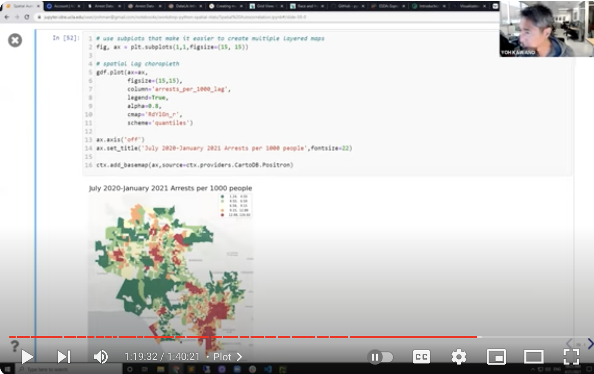

# **Introduction to Spatial Statistics with Python**

## [Workshop Link](https://www.youtube.com/watch?v=B_LHPRVEOvs)

## [Link to workshop materials](https://github.com/yohman/workshop-python-spatial-stats)

Visual interpretations are meaningful ways to determine spatial trends in our data. However, underlying factors—such as inconsistent geographies, scale, data gaps, overlapping data—have the potential to produce incorrect assumptions, as valuable information may be conveniently hidden from the visual output.

One way to address this issue is to amend your visual output with geo-statistical validation. In this workshop, we will use Python to look at one such approach: Spatial Autocorrelation

(taken from youtube description)

## Topics covered (taken from youtube timestamps)
- Libraries
- Data Preparation
- Matplotlib subplots
- Spatial join
- Normalizing
- Getting data from LA Open Data
- Moran's Scatterplot
- Maps
    - Choropleth
    - Interactive spatial lag map
    - Spatial Autocorrelation Map

## Related Workshops 
- [Spatializing Data with R](./index.md)
- ....
- ....

